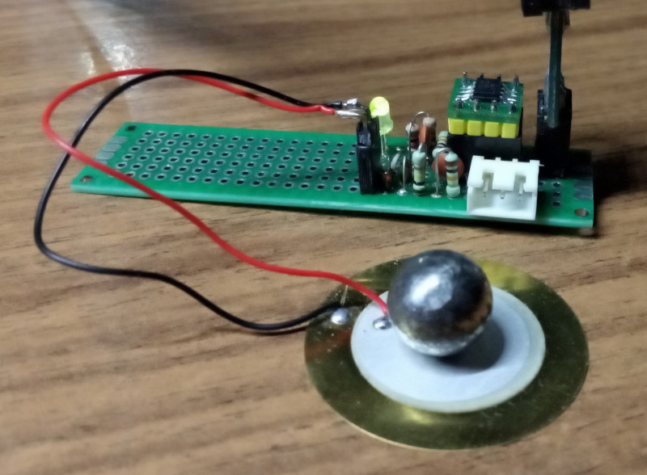
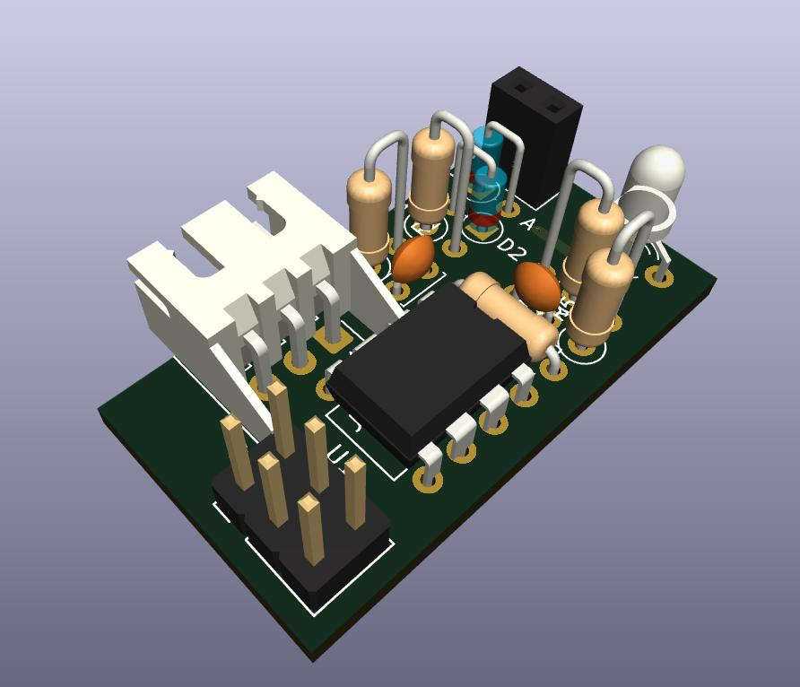
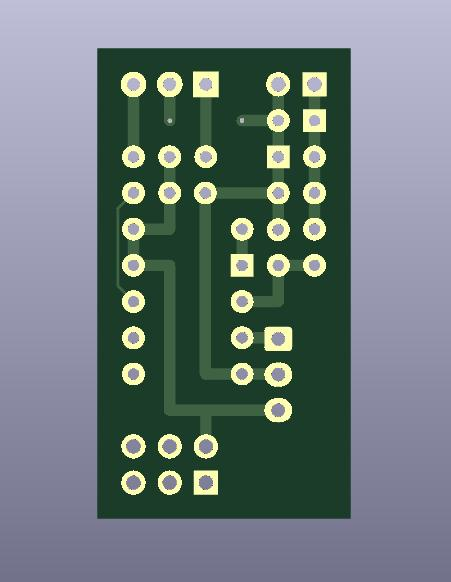

# Пьезоконцевик TAP350

Для дельтапринтеров и прочих воронов

* Микроконтроллер attiny13a
* Пьеза 35мм
* Шар 8г (тяжелее 10г может не работать)

Прошивочный разъём при*ан на от**бись мгтф проводом.

Основан на схеме и прошивке https://github.com/ripinteer/tap-attiny/
